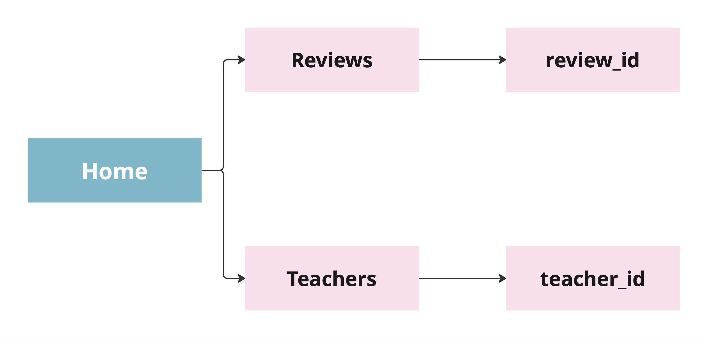
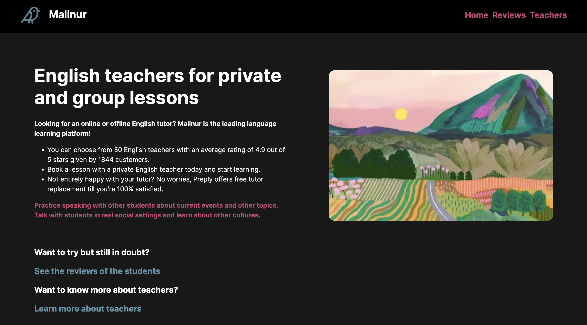
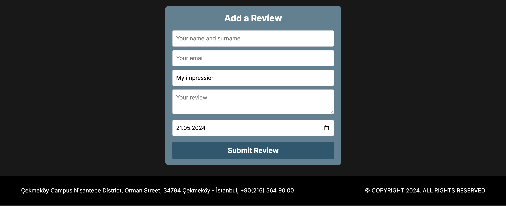
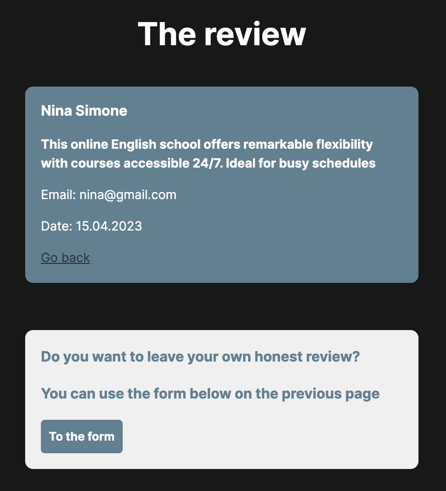

## 1. Page flow diagram

## 2. Usage scenario

### **Menu items are:**

### **Home**

### **Reviews** 

Reviews of others:

Ability to add own review:

### **Teachers** 

### **Additional pages are:**

### **Review ID** 

### **Teacher ID** 

Page before adding own review:

Page after adding own review, with ability to delete it:

